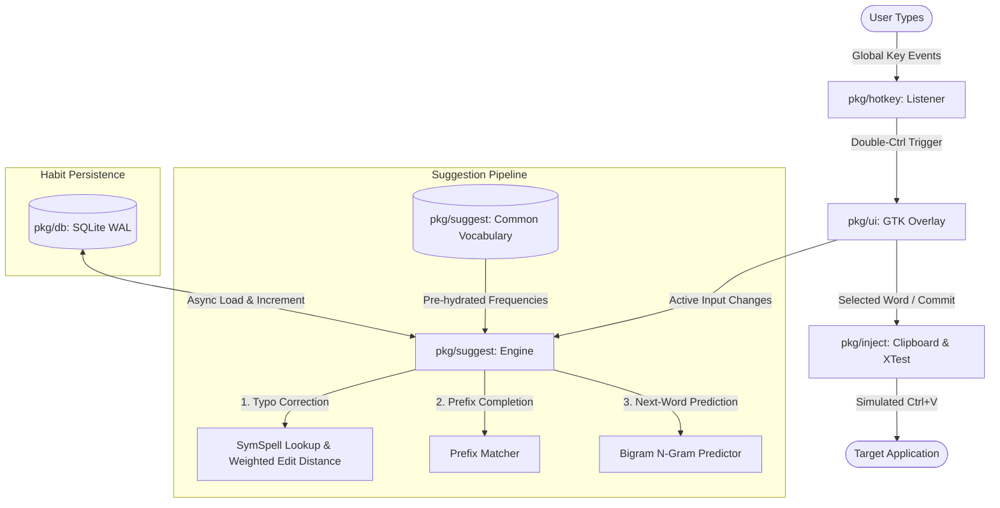

# Zen-Typo: Architectural Overview

`zen-typo` is a high-performance, system-wide autocomplete and sentence-prediction daemon for Linux X11 environments. It operates completely out-of-band from heavy input method frameworks (such as IBus or Fcitx), providing a lightweight, low-latency autocomplete experience with a floating visual overlay.

---

## High-Level Architecture & Data Flow

The following diagram illustrates how user key events flow from the global keyboard monitor down to the suggestion engine, database persistence, overlay rendering, and text injection:

---

## Core Components

### 1. Global Hotkey Listener (`pkg/hotkey`)
*   **Purpose**: Monitors key presses globally under X11 to capture key combos without hogging active focus.
*   **Mechanism**: Uses `XRecord` (with CGO wrapper) to establish an asynchronous recording context. 
*   **Triggers**: Tracks timings between consecutive `Control` key releases. A delta below `250ms` fires the double-Ctrl callback, bringing the overlay to the front.

### 2. GTK-3 Overlay UI (`pkg/ui`)
*   **Purpose**: Renders the input text area and word candidates with premium aesthetics.
*   **Aesthetics & Sizing**: Uses customized, high-contrast dark CSS (explicit white `#ffffff` input background with black `#000000` text) to ensure legibility across all custom Linux/GTK system themes. 
*   **Performance**: Utilizes `gotk3`'s native GTK event-driven loop. When hidden, it uses **0% CPU**, consuming no active loop cycles.
*   **Signals**: Integrated with Escape (close), Enter (commit highlighted candidate), Tab (apply first candidate), and Left/Right arrow keys (candidate cycle).

### 3. Suggestion Engine (`pkg/suggest`)
*   **Components**:
    *   **Common Vocabulary (`common_words.go`)**: Hydrated with the top 800+ English words mapped to their natural occurrences to bootstrap completions instantly.
    *   **SymSpell Fuzzy spelling**: Utilizes pre-computed deletion dictionaries for sub-millisecond typo matching up to an edit distance of 2.
    *   **Custom Math Scoring**: Candidates are ranked using a heavy exponential penalty decay base (`1.0 / math.Pow(250.0, editDistance)`) to ensure single-character corrections are never drowned out by double-character modifications of common words.
    *   **N-Gram Prediction**: A custom bigram dictionary tracking combinations (e.g. "look forward", "how are").

### 4. Asynchronous Learning Database (`pkg/db`)
*   **Purpose**: Continuously refines predictions based on the user's personal typing style.
*   **Backend**: SQLite database running in Write-Ahead Logging (`WAL`) mode with `NORMAL` synchronous flags.
*   **Asynchronous Updates**: Learning increments (word counts and bigram transitions) are executed in background goroutines, guaranteeing that writing to disk never blocks GTK UI render frames.

### 5. Paste Injector (`pkg/inject`)
*   **Purpose**: Pastes the finalized string back into the user's active editor.
*   **Mechanism**: Copies the committed text directly to the global clipboard (`xclip` wrapper) and triggers `Ctrl+V` key simulation using the `XTest` native extension.

---

## Portability Configuration Model

Adhering to multi-path portable standards, database location resolution checks paths in the following priority order:

1.  **Binary Directory**: If `portable.dat` or `habit.db` exists in the folder containing the binary, the application locks into **Portable Mode**, reading/writing data strictly alongside the executable.
2.  **Current Working Directory (CWD)**: Allows running project-specific instances from local workspaces.
3.  **User Config Directory**: Falls back to the standard Linux configuration path (`~/.config/zen-typo/habit.db`).

The exact database file path chosen is always logged to standard error on start.

---

## Architectural Rationale

*   **No Cloud Dependency**: Native spellchecking and next-word inference happen purely on-device, keeping user input strictly private.
*   **Memory Efficiency**: By caching frequencies in a memory map and updating the database asynchronously, memory remains below `40MB` and query latency remains sub-millisecond.
*   **Theme Independence**: Fusing both the background and color CSS properties for inputs bypasses the common Linux problem where active system GTK themes override overlay text visibility.
